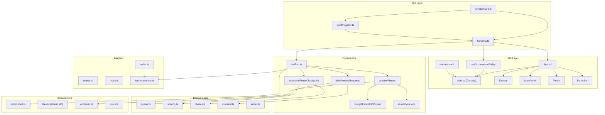
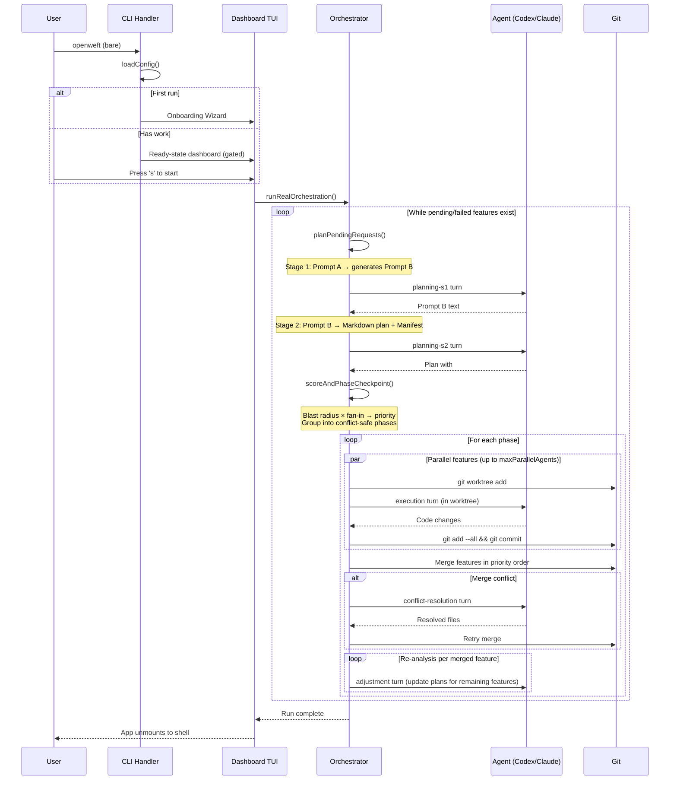
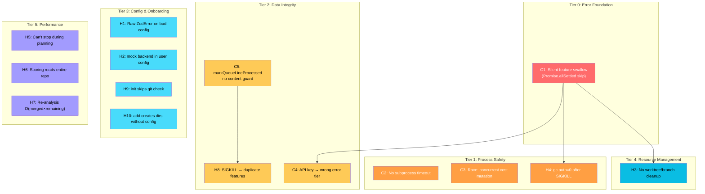
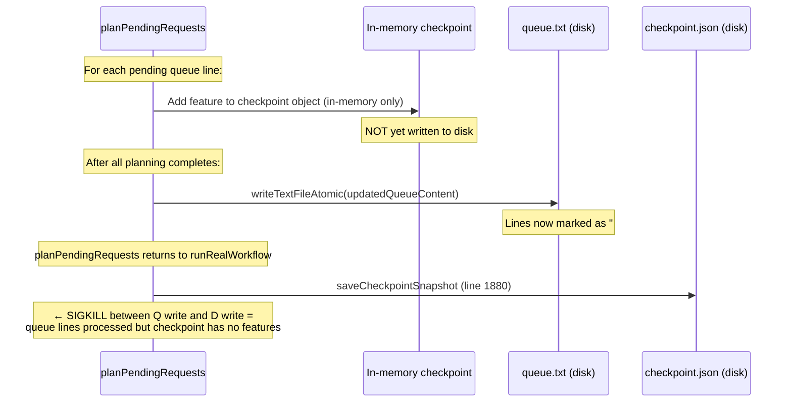
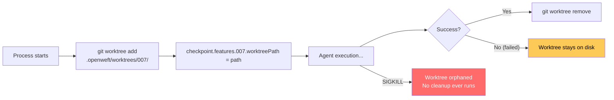

## Instructions

Work through each issue below. For each issue:

1. Read the referenced source files and confirm the problem still exists.
2. Implement the smallest fix that resolves it with 100% success confidence percentage without introducing any problems.
3. Write or update tests to cover the fix.
4. Run `npm run typecheck && npm test` to verify nothing broke.
5. Move to the next issue.

Do not skip tiers or reorder — earlier tiers fix foundational problems that later tiers depend on.

---

# OpenWeft Codebase Audit — v0.1.0 Pre-Launch

**Date:** 2026-03-16
**Scope:** Full codebase investigation across all subsystems
**Method:** 8 parallel deep-dive agents covering CLI, planning, execution, state, TUI, config, merge/phasing, and error handling

---

## Table of Contents

1. [Architecture Overview](#1-architecture-overview)
2. [The Pipeline — How It Actually Works](#2-the-pipeline)
3. [Issue Dependency Map](#3-issue-dependency-map)
4. [Tier 0 — Error Foundation](#4-tier-0--error-foundation)
5. [Tier 1 — Process Safety](#5-tier-1--process-safety)
6. [Tier 2 — Data Integrity](#6-tier-2--data-integrity)
7. [Tier 3 — Configuration & Onboarding](#7-tier-3--configuration--onboarding)
8. [Tier 4 — Resource Management](#8-tier-4--resource-management)
9. [Tier 5 — Performance](#9-tier-5--performance)
10. [Tier 6 — TUI / User Experience](#10-tier-6--tui--user-experience)
11. [Tier 7 — Algorithmic Concerns](#11-tier-7--algorithmic-concerns)
12. [Tier 8 — Dead Code](#12-tier-8--dead-code)
13. [Verification Gates](#13-verification-gates)

---

## 1. Architecture Overview



### Module Inventory

| Directory | Files | Purpose |
|-----------|-------|---------|
| `src/cli/` | 2 | Commander program, handler implementations |
| `src/ui/` | 17 + 12 onboarding | Ink TUI dashboard, Zustand store, keyboard, theme |
| `src/orchestrator/` | 5 | Main loop, dry run, approval, audit, stop |
| `src/domain/` | 11 | Queue, scoring, phasing, manifest, costs, errors |
| `src/adapters/` | 7 | Codex/Claude/Mock adapters, subprocess runner |
| `src/git/` | 1 | Worktree management, merge, conflict detection |
| `src/state/` | 1 | Checkpoint schema, atomic save/load |
| `src/fs/` | 3 | Atomic file I/O, path resolution, init helpers |
| `src/config/` | 2 | Zod schema, cosmiconfig loading |

---

## 2. The Pipeline



### Execution Modes Matrix

| Invocation | TTY | Config | Mode |
|-----------|-----|--------|------|
| `openweft` | yes | no | Onboarding wizard |
| `openweft` | no | no | `init` + hint text |
| `openweft` | yes | yes + work | Gated ready-state TUI |
| `openweft` | no | yes + work | Headless run (`handlers.start({})`) |
| `openweft` | yes | yes + no work | Status card |
| `openweft start` | yes | yes | Non-gated TUI |
| `openweft start` | no | yes | Headless run |
| `openweft start --bg` | any | yes | Detached child process |
| `openweft start --tmux` | any | yes | tmux session with slot panes |
| `openweft start --dry-run` | any | yes | Headless mock run |

---

## 3. Issue Dependency Map

Issues are organized into tiers. **Tier 0 must be fixed first** because it masks errors that downstream fixes depend on detecting. Within each tier, issues are independent unless noted.



---

## 4. Tier 0 — Error Foundation

### C1: `Promise.allSettled` silently swallows rejected features

**Severity:** Critical
**File:** `src/orchestrator/realRun.ts:1467-1470`
**Why this is Tier 0:** Every other error that throws from within a phase task (worktree creation, git errors, unexpected exceptions) is silently dropped by this code. Fixing downstream error handling is pointless until this is addressed.

```typescript
// CURRENT — rejected entries are silently skipped
for (const settledFeature of settled) {
  if (settledFeature.status === 'rejected') {
    continue;  // ← feature vanishes. No error logged. No lastError set. No audit entry.
  }
  // ... only fulfilled entries are processed
}
```

**What happens:** If `createWorktree` throws, or a non-conflict git error occurs during merge, or any unexpected exception escapes the `queue.add` callback — the feature stays in `executing` status in the checkpoint forever. No `lastError` is written. No audit trail entry. No user-visible error. The feature is silently lost until the next run resets `executing` → `planned`.

**Cascading impact:**
- H3 (orphan cleanup) — this previously hid orphan-creation failures; Tier 4 now adds startup pruning for orphaned worktrees and branches
- H4 (gc.auto) — the `finally` block runs but the feature error is lost
- C4 (API key) — even if we fix classification, a `fatal` throw from `buildCommand` would be swallowed here

**Fix direction:** Log rejected entries, set `lastError` on the checkpoint feature, write an audit entry, and mark the feature as `failed`:

```typescript
for (const settledFeature of settled) {
  if (settledFeature.status === 'rejected') {
    const error = settledFeature.reason;
    // Need to determine which featureId this was — currently lost.
    // The queue.add callback should catch and return a typed result instead of throwing.
    continue;
  }
  // ...
}
```

**Root cause:** The `queue.add` callbacks in `executePhases` (lines 1400-1460) don't wrap their internals in try/catch to produce a typed `FeatureExecutionResult`. Instead, they let exceptions propagate naturally, which `Promise.allSettled` catches as `rejected` — but then the handler ignores them.

---

## 5. Tier 1 — Process Safety

### C2: No subprocess timeout

**Severity:** Critical
**File:** `src/adapters/runner.ts:17-28`

```typescript
// CURRENT — no timeout option passed to execa
const result = await execa(spec.command, spec.args, {
  cwd: spec.cwd,
  reject: false,
  stdout: (options.stdout ?? 'pipe') as never,
  stderr: (options.stderr ?? 'pipe') as never,
  stdin: (options.stdin ?? 'pipe') as never,
  stripFinalNewline: false,
  // ← no timeout: ... option
  ...(spec.env ? { env: spec.env } : {}),
  ...(spec.input !== undefined ? { input: spec.input } : {}),
});
```

**What happens:** If `codex` or `claude` subprocess hangs (network issue, API freeze, infinite loop), the `p-queue` slot is blocked forever. No other phases can start. The entire run hangs indefinitely with no user feedback. The only escape is killing the parent process.

**Fix direction:** Add a configurable timeout (e.g., 30 minutes default for execution, 10 minutes for planning):

```typescript
const result = await execa(spec.command, spec.args, {
  // ...existing options...
  timeout: spec.timeout ?? 30 * 60 * 1000, // 30 minutes default
});
```

The `timeout` option in execa sends SIGTERM to the child, then SIGKILL after a grace period.

---

### C3: Concurrent checkpoint cost mutation

**Severity:** Critical
**File:** `src/orchestrator/realRun.ts:130-137`

```typescript
const appendCostRecord = async (
  config: ResolvedOpenWeftConfig,
  checkpoint: OrchestratorCheckpoint,
  record: CostRecord
): Promise<void> => {
  await appendJsonLine(config.paths.costsFile, record);
  checkpoint.cost = addCostRecordToTotals(checkpoint.cost, record);
  //                ↑ non-atomic read-modify-write on shared mutable object
};
```

**What happens:** Multiple features in a phase run concurrently via `p-queue`. Each calls `appendCostRecord` after its agent turn completes. `addCostRecordToTotals` reads `checkpoint.cost`, computes new totals, and assigns back. If two features complete near-simultaneously, the second write overwrites the first's totals — cost data is lost.

**Additionally**, `availableTmuxSlots` array mutations (`Array.shift()` / `Array.push()`) at lines 1417 and 1445 have the same race condition pattern.

**Fix direction:** Serialize cost updates through a mutex or accumulate cost records and batch-apply after `Promise.allSettled`.

---

### H4: `gc.auto=0` left permanent after SIGKILL

**Severity:** High
**File:** `src/orchestrator/realRun.ts:1354-1855`

```typescript
const previousGc = await getAutoGcSetting(context.config.repoRoot);
await setAutoGc(context.config.repoRoot, '0');

try {
  // ... entire phase execution loop ...
} finally {
  await restoreAutoGc(context.config.repoRoot, previousGc);  // ← only runs on graceful exit
}
```

**What happens:** SIGKILL is uncatchable. If the process is force-killed inside `executePhases`, `gc.auto` remains `0` in the local git config permanently. Git garbage collection is disabled for the repo until either:
- The next successful OpenWeft run restores it
- The user manually runs `git config --unset gc.auto`

**Fix direction:** Write the previous `gc.auto` value to a file in `.openweft/` before setting it to `0`. On startup, check for this file and restore if present.

---

## 6. Tier 2 — Data Integrity

### C4: Missing API key classified as `agent` tier instead of `fatal`

**Severity:** Critical
**File:** `src/adapters/shared.ts:52-65` and `src/domain/errors.ts:9-18`

```typescript
// shared.ts — resolveAuthEnvironment throws synchronously, caught in adapter's runTurn
if (!envValue) {
  throw new Error(`Missing required API key environment variable ${envVar}.`);
}
```

```typescript
// errors.ts — FATAL_PATTERNS that are checked
const FATAL_PATTERNS = [
  /not logged in/i,
  /authentication/i,
  /auth failed/i,
  /command not found/i,
  /enoent/i,
  /enospc/i,
  /disk full/i,
  /invalid config/i,
  /template empty/i
];
```

**What happens:** The error message `"Missing required API key environment variable ANTHROPIC_API_KEY"` does NOT match any `FATAL_PATTERN`. The word "Missing" and "API key" are not in the list. It falls through to `agent` tier (the default), causing one wasted retry attempt before the feature fails.

**Fix direction:** Add `/missing.*api key/i` or `/environment variable/i` to `FATAL_PATTERNS`.

---

### C5: `markQueueLineProcessed` has no content verification

**Severity:** Critical
**File:** `src/domain/queue.ts:116-140`

```typescript
export const markQueueLineProcessed = (
  existingContent: string,
  lineIndex: number,
  featureId: string,
  requestOverride?: string
): string => {
  const parsed = parseQueueFile(existingContent);
  const target = parsed.lines.find((line) => line.lineIndex === lineIndex);

  if (!target) { throw new Error(`Queue line ${lineIndex} does not exist.`); }
  if (target.kind !== 'pending') { throw new Error(`...not pending...`); }

  const rawLines = existingContent.split(/\r?\n/);
  // ...
  rawLines[lineIndex] = `# ✓ [${featureId}] ${requestOverride ?? target.request}`;
  //                      ↑ overwrites whatever is at lineIndex — no content check
  return /* ... */;
};
```

**Contrast with `removePendingQueueLine`** which has an `expectedRequest` parameter:

```typescript
// removePendingQueueLine has this guard:
if (expectedRequest !== undefined && target.request !== expectedRequest) {
  throw new Error(`Queue line ${lineIndex} no longer matches...`);
}
```

**What happens:** If `queue.txt` is modified externally (editor, another process, TUI `onAddRequest`) between the read at `realRun.ts:904` and the write at `realRun.ts:995`, `lineIndex` may point to a different line. `markQueueLineProcessed` will silently overwrite the wrong line.

**Fix direction:** Add an `expectedRequest` parameter to `markQueueLineProcessed` matching the pattern in `removePendingQueueLine`.

---

### H8: SIGKILL between queue write and checkpoint save orphans planned features

**Severity:** High
**File:** `src/orchestrator/realRun.ts:995, 1879-1881`



**What happens:** The checkpoint mutations during planning (line 975) are in-memory only — they modify a cloned object. The queue file is written to disk at line 995 (marking lines as `# ✓ [001] ...`). The checkpoint is flushed to disk at line 1880, after `planPendingRequests` returns. If killed between lines 995 and 1880:
- Queue lines are marked "processed" on disk
- Checkpoint on disk has no record of those features
- Plan files exist in `feature_requests/`
- On resume: no pending queue lines, no checkpoint entries → features are silently orphaned (plan files exist but nothing executes them)

**Fix direction:** Flush the checkpoint to disk inside `planPendingRequests` after the queue file write, or write both atomically.

---

## 7. Tier 3 — Configuration & Onboarding

### H1: Invalid config produces raw ZodError crash

**Severity:** High
**File:** `src/config/loadConfig.ts:134-151`

```typescript
export const loadOpenWeftConfig = async (cwd = process.cwd()) => {
  // ...
  const parsedConfig = mergeConfigWithDefaults(result?.config);
  // ↑ calls OpenWeftConfigSchema.parse() internally
  // If validation fails, ZodError propagates uncaught to Node.js top-level
  // User sees: "ZodError: [{ code: 'invalid_type', expected: 'string', ... }]"
};
```

**What happens:** A user with `"backend": "openai"` or an extra field (all schemas use `.strict()`) gets an unformatted multi-line ZodError stack trace. No suggestion about what to fix. No pointer to the config file.

**Fix direction:** Wrap the parse in try/catch, format the ZodError issues into human-readable messages:

```
Error in .openweftrc.json:
  • backend: Expected 'codex' | 'claude', received 'openai'
```

---

### H2: `backend: 'mock'` is a valid user-facing config value

**Severity:** High
**File:** `src/domain/primitives.ts`

```typescript
export const BackendSchema = z.enum(['codex', 'claude', 'mock']);
```

**What happens:** A user who writes `"backend": "mock"` in their `.openweftrc.json` silently runs the `MockAgentAdapter` against real queue data. The mock adapter actually writes files to disk (via `applyManifestToWorkspace`), so it produces real filesystem changes from fake plans.

**Fix direction:** Use separate schemas: `UserBackendSchema = z.enum(['codex', 'claude'])` for config validation, keep `BackendSchema` for internal use.

---

### H9: `openweft init` doesn't check for git

**Severity:** High
**File:** `src/cli/handlers.ts:626-684`

**What happens:** `init` creates `.openweftrc.json`, `.openweft/`, `feature_requests/queue.txt`, and prompt files — even in a non-git directory. The user proceeds to add features and run `start`, which fails deep inside `executePhases` when `git worktree add` throws. The error message is a raw git error, not "This directory is not a git repository."

**Contrast:** The onboarding wizard (`runOnboardingWizard`) checks `detectGitRepo()` upfront. The `init` handler does not.

---

### H10: `openweft add` creates directories without requiring config

**Severity:** High
**File:** `src/cli/handlers.ts:685-726`

**What happens:** Running `openweft add "fix auth"` in any directory — even one where OpenWeft was never initialized — will silently create directories and a queue file. If no config is found anywhere in the directory ancestry (cosmiconfig uses `searchStrategy: 'global'`), default paths are used (e.g., `./feature_requests/queue.txt`). If a parent directory has a config, those paths are used instead. Either way, no explicit init is required.

---

### U11: Wizard `StepAddMore` input mode has no cancel

**Severity:** Medium
**File:** `src/ui/onboarding/StepAddMore.tsx`

In the "Add another request" input mode, `Esc` quits the entire wizard. There is no way to return to the select menu without submitting or exiting.

---

### U12: Wizard `StepBackends` has no retry after auth fix

**Severity:** Medium
**File:** `src/ui/onboarding/StepBackends.tsx`

When neither backend is authenticated, the wizard shows auth commands but blocks progress. After the user fixes auth in another terminal, they must quit and re-run the wizard. The `onRedetectBackends` callback exists but is only called on mount, not exposed as a "Retry" action.

---

## 8. Tier 4 — Resource Management

### H3: No orphaned worktree/branch pruning

**Severity:** High
**Files:** `src/git/worktrees.ts`, `src/orchestrator/realRun.ts`

**Status:** Resolved 2026-03-16. OpenWeft now prunes orphaned `.openweft/worktrees/*` entries and `openweft-*` branches at startup while preserving artifacts still referenced by actionable checkpoint features.



**What happens:**
- **Failed features:** Worktrees are NOT cleaned up on failure. They persist until the feature is retried on the next run, where `createOrResetFeatureWorktree` removes and recreates.
- **SIGKILL:** If the checkpoint recorded `worktreePath`, the next run cleans it up. If not (killed between worktree creation and checkpoint save), the directory is orphaned forever.
- **Never resumed:** If the user never re-runs, `.openweft/worktrees/` and `openweft-*` branches accumulate indefinitely.

There is still no dedicated `openweft cleanup` command, but startup now performs a conservative scan-and-prune pass before the run begins.

**Fix direction:** Add a startup scan that lists `.openweft/worktrees/` entries and `openweft-*` branches, cross-references with the checkpoint, and removes orphans.

---

## 9. Tier 5 — Performance

### H5: Stop controller not wired into `planPendingRequests`

**Severity:** High
**File:** `src/orchestrator/realRun.ts:899-1000`

```typescript
const planPendingRequests = async (context: RealRunContext) => {
  // ...
  for (const pending of parsedQueue.pending) {
    // ← No stopController check here
    // Stage 1 turn (could take minutes)...
    // Stage 2 turn (could take minutes)...
    // Repair turn if needed...
  }
};
```

**What happens:** If the user presses `q` (quit) during a planning batch, the stop request is set but planning runs to completion. With 10+ queued features, this could mean 20+ minutes of unstoppable LLM calls.

**The stop controller IS checked** in `executePhases` (line 1359), between phases (line 1502), and during re-analysis — but never during planning.

---

### H6: `collectScoringPaths` reads the entire repository

**Severity:** High
**File:** `src/orchestrator/realRun.ts:535-555`

```typescript
for (const sourceFile of sourceFiles) {                    // ← every file in the repo
  const relativeSource = path.relative(repoRoot, sourceFile).replace(/\\/g, '/');
  const content = await readFile(sourceFile, 'utf8').catch(() => '');  // ← reads full content

  for (const target of normalizedNeedles) {                // ← every manifest path
    if (relativeSource === target.path) {
      continue;                                            // ← self-exclusion guard
    }

    if (content.includes(target.exact) || content.includes(target.withoutExtension)) {
      fanInByPath[target.path] = (fanInByPath[target.path] ?? 0) + 1;
    }
  }
}
```

**What happens:** For a repo with 5,000 source files and 20 manifest paths, this performs 100,000 substring searches across megabytes of file content. There is no:
- Size limit (skips nothing — even binary files unless they fail `readFile`)
- Timeout
- Progress indication
- Incremental yielding (blocks the event loop)

On a large monorepo, this can freeze the process for minutes.

---

### H7: Re-analysis is O(merged × remaining)

**Severity:** High
**File:** `src/orchestrator/realRun.ts:1715-1760`

```typescript
for (const mergedSummary of mergeSummaries) {        // ← once per merged feature
  const remaining = Object.values(checkpoint.features).filter((feature) =>
    feature.status === 'planned' || feature.status === 'failed'
  );

  if (remaining.length === 0) {
    break;                                            // ← early exit when all done
  }

  const template = await readTextFileWithRetry(context.config.paths.planAdjustment);
  for (const feature of remaining) {                  // ← once per remaining feature
    if (!feature.planFile) {
      continue;
    }
    // ... reads plan, builds adjustment prompt ...
    const prompt = buildPlanAdjustmentPrompt({ ... });
    await runTurnAndRecord(context, adjustmentRequest);  // ← full LLM call per combination
  }
}
```

**What happens:** If a phase merges 5 features and 15 features remain, this fires **75 LLM adjustment calls**. With 10 merged + 20 remaining, it's **200 calls**. Each call is a full agent turn with network latency.

**Fix direction:** Batch merged summaries into a single adjustment prompt per remaining feature, reducing to O(remaining).

---

## 10. Tier 6 — TUI / User Experience

### U1: Spinner never animates

**Severity:** Medium (high visual impact)
**File:** `src/ui/utils.ts`

```typescript
export const getStatusIcon = (status: AgentStatus): StatusIconResult => {
  switch (status) {
    case 'running':   return { icon: '⠋', colorKey: 'blue' };   // ← static single frame
    case 'completed': return { icon: '✓', colorKey: 'green' };
    case 'failed':    return { icon: '✗', colorKey: 'red' };
    case 'queued':    return { icon: '○', colorKey: 'muted' };
    case 'approval':  return { icon: '⚠', colorKey: 'yellow' };
  }
};
```

**What happens:** The `⠋` braille spinner character is rendered once and never changes. Running agents look identical every second. The 1-second timer ticks `elapsed` but does not advance a spinner frame. First-time users will think the dashboard is frozen.

**Fix direction:** Add a `spinnerFrame` counter to the store, increment in the timer, cycle through braille frames `['⠋','⠙','⠹','⠸','⠼','⠴','⠦','⠧','⠇','⠏']`.

---

### U2: Sidebar has no scroll mechanism

**Severity:** Medium
**File:** `src/ui/Sidebar.tsx`

The sidebar is a fixed `width={24}` flex column with no overflow handling. If the agent list exceeds terminal height, items are silently clipped with no scroll indicator, no page-up/page-down, and no visual indication that more items exist.

---

### U3: Main panel doesn't auto-scroll to latest output

**Severity:** Medium
**File:** `src/ui/MainPanel.tsx`

```typescript
// Output is sliced from scrollOffset (default 0 = oldest lines)
const viewportLines = lines.slice(scrollOffset, scrollOffset + viewportHeight);
```

**What happens:** When an agent is actively producing output, the view stays pinned to line 0 (the oldest output). Users must manually press `Tab` to switch focus, then `↓` repeatedly to see current output. There is no "follow tail" or auto-scroll behavior.

---

### U4: No `j`/`k` vim-style navigation

**Severity:** Low
**File:** `src/ui/hooks/useKeyboard.ts`

Arrow keys (`↑`/`↓`) work for navigation, but `j`/`k` are silently dropped (`return 'unhandled'`). The target audience is power users (lazygit, tmux users) who universally expect vim-style keys.

---

### U5: Filter `↑↓ history` hint is displayed but not implemented

**Severity:** Low
**File:** `src/ui/Footer.tsx`

The `input` mode footer shows `↑↓ history` as a key hint, but no history array exists in the store and the keyboard handler doesn't process up/down in input mode. This is misleading.

---

### U6: No completion screen

**Severity:** Medium
**File:** `src/cli/handlers.ts`

When `runRealOrchestration` completes, `app.instance.unmount()` is called immediately. The terminal returns to the shell prompt with no summary, no success banner, no final statistics. Users have no confirmation within the TUI that the run finished successfully.

---

### U7: Help overlay doesn't adapt to current mode

**Severity:** Low
**File:** `src/ui/HelpOverlay.tsx`

The help overlay shows a static list of ready-state keys (`s start`, `d remove`, `a add`) regardless of whether execution is in progress (where those keys are disabled). Approval mode keys (`y`/`n`/`a`/`s`/`Esc`) are never shown.

---

### U8: Notice banner never auto-clears

**Severity:** Low
**File:** `src/ui/store.ts`

`setNotice()` is called with error messages (e.g., queue write failure) that persist indefinitely until the session ends. There is no auto-dismiss timeout.

---

### U9: Cannot add work during execution

**Severity:** Medium
**File:** `src/ui/hooks/useKeyboard.ts`

The `a` key is disabled when `executionRequested === true`. Users cannot queue additional features to an in-progress run. They must wait for completion, then re-run.

---

### U10: Between-phase blank period with no indicator

**Severity:** Low
**File:** `src/ui/events.ts`

`phase:completed` clears phase info to `null`. The StatusBar shows nothing. The sidebar footer shows `Idle`. There is no "Re-analyzing..." or "Planning next phase..." indicator during the gap between phases.

---

## 11. Tier 7 — Algorithmic Concerns

These are design-level observations that don't block launch but should be tracked for post-launch improvement.

### A1: Fan-in is a substring scan, not an import graph

`collectScoringPaths` (line 548-553) checks if `content.includes(targetPath)`. A test file that mentions `src/lib/auth.ts` in a comment inflates that file's fan-in. Minified bundles or lock files would dramatically distort counts. Only `.git`, `node_modules`, and `.openweft` are excluded.

### A2: Single-feature scoring degenerates

When scoring only one feature, `normalizeValue` returns 0 (min=max), so `rawPriority = successLikelihood / 0.01 ≈ 85`. This is well above the EWMA baseline, causing priority to oscillate when more features are added.

### A3: EWMA freezes after 2 cycles

After 2 scoring cycles, `lambda = 0.25` — meaning 75% of the priority is historical. A feature whose manifest was substantially updated by re-analysis will have its corrected score suppressed by the stale average.

### A4: Conflict resolution prompt has no plan context

The agent is told to "resolve all conflict markers, preserve both sides, then commit" with no reference to the feature's plan, no guidance about which side to prefer, and no information about what the conflicting feature was doing.

### A5: `git add --all` stages untracked files

`commitAllChanges` runs `git add --all` which stages everything in the worktree, including debugging artifacts, temporary files, or binary files the agent may have created.

### A6: No queue request deduplication

Two identical lines in `queue.txt` produce two separate plans, two separate features, and two separate executions. There is no deduplication at any stage.

### A7: `RelativeFilePathSchema` rejects paths with spaces

The regex `^[\w./@-][\w./@-]*$` does not allow spaces or parentheses. Legitimate filenames like `User Profile/index.ts` trigger unnecessary manifest repair.

### A8: Phase packing is greedy first-fit (order-dependent)

Features are placed in the first compatible phase found. The result depends on sort order, which means near-equal-priority features may land in suboptimal phases. This is a known NP-hard problem and first-fit is a reasonable tradeoff, but it's undocumented.

### A9: Single `String.replace` for `{{USER_REQUEST}}`

`injectPromptTemplate` uses a non-global replace. If `prompt-a.md` contains the marker twice (e.g., in a note), only the first occurrence is replaced.

---

## 12. Tier 8 — Dead Code

| Item | Location | Lines |
|------|----------|-------|
| XState machine defined but never started | `realRun.ts:1926-1980` | 54 |
| `createActor`, `assign`, `fromPromise` imports unused | `realRun.ts:7` | 1 |
| `mergeBranchesInOrder` exported but never called | `worktrees.ts:424-445` | 21 |
| Theme color `pink` defined but unused | `theme.ts` | 1 |

The XState machine at `realRun.ts:1926` wraps `runRealWorkflow` as a single `fromPromise` actor with states `running` → `completed`/`failed`. Since `runRealOrchestration` calls `runRealWorkflow` directly (line 1996), the machine provides no value. The `dryRun.ts` counterpart correctly uses `createActor`.

**Note:** `program.action()` in `buildProgram.ts:43` is NOT dead code — it is the live default handler for bare `openweft` invocations. Theme colors `sky`, `teal`, and `lavender` are used in onboarding components (`StepFeatureInput.tsx`, `StepAddMore.tsx`, `StepLaunch.tsx`).

---

## 13. Verification Gates

After implementing any changes, these gates must all pass:

```bash
# Type safety
npm run typecheck

# Full test suite (currently 487 tests)
npm test

# Complete publish gate (typecheck + test + build + npm publish --dry-run)
npm run release:check

# Verify no dev artifacts tracked
git ls-files docs/          # Should show only 4 SVG banners
git ls-files .github/       # Should show workflows/ci.yml
git ls-files AGENTS.md      # Should be empty

# Verify .gitignore correctness
git status                  # No unexpected untracked files
```
