# OpenWeft — coding-agent batch scheduling and recovery

OpenWeft is a batch scheduler and recovery layer for coding agents: it turns a **list of your entered goals into durable Work Briefs, runs non-conflicting Claude Code/Codex tasks in isolated worktrees, and preserves enough state to recover through crashes, conflicts, and merge reconciliation.**

**You write a list. You walk away. You come back to commits.**

**It runs on your existing subscription by default. No API keys required unless you opt into API-key auth.**

It is not a replacement for Claude Code or Codex. It is the missing batch-control layer around them: planning, phasing, worktree isolation, checkpoint recovery, merge reconciliation, and auditability.

> **Architecture deep dive:** OpenWeft is designed as a real orchestration system, not a prompt wrapper. See [ARCHITECTURE.md](./ARCHITECTURE.md) for the full breakdown of the planning compiler, scoring algorithm, phase scheduler, worktree isolation, checkpoint recovery, finalization, and runtime diagnostics.

<p align="center">
  <picture>
    
  </picture>
</p>

<p align="center">
  <a href="LICENSE"></a>
  <a href="https://github.com/sponsors/NeuraCerebra-AI"></a>
</p>

## Quick start

```bash
npm install -g openweft
openweft                                  # wizard on first run
```

Queue some features, then let it rip:

```bash
openweft add "add password reset flow"
openweft add "refactor auth middleware"
openweft add "add audit log export"
openweft start
```

```
$ openweft status

Health: Completed
Meaning: All schedulable work in the current checkpoint has finished.
Next Action: Review the completed features, merge output, and audit trail before adding more work.
Status: completed
Machine State: idle
Background: not running
Pending Queue: 0
Processed Queue Entries: 3
Features: 3 total (3 completed)
Tokens: 384000 input / 4000 output
Completed:
  [001] Add password reset flow (high 0.891)
  [002] Add audit log export (high 0.912)
  [003] Refactor auth middleware (medium 0.544)
```

Features 1 and 2 ran in parallel — no file overlap. Feature 3 touched the same auth files, so OpenWeft queued it for the next batch and re-planned against the merged code. Three features, two batches, zero babysitting. Status starts with health, meaning, and a safe next action before raw details and token counts.

<p align="center">
  <picture>
    
  </picture>
</p>

<p align="center">
  <picture>
    
  </picture>
</p>

<p align="center">
  <picture>
    
  </picture>
</p>

## When to use OpenWeft

**✅ Good Fit**

- You have a backlog of independent or semi-independent feature requests.
- Some tasks may touch overlapping files and need scheduling before execution.
- You want agents isolated in git worktrees, merged in priority order, and resumed after crashes.
- You want an inspectable trail of plans, manifests, ledgers, checkpoints, and audit events.

**⚠️ Not A Fit**

- You need one quick edit; run Codex or Claude directly.
- You want interactive pair-programming instead of batch execution.
- Your repository cannot use git worktrees.
- You expect a polished 1.0 product surface.

Requires Node.js `>=24`, Git, and one or both of `codex` / `claude` already logged in.

---

## What OpenWeft proves

OpenWeft is an orchestration layer for coding agents, not a prompt wrapper and not another general-purpose agent framework.

Its core claim is narrow: when you have a backlog of coding tasks, the hard part is not merely launching several agents. The hard part is deciding which tasks can safely run together, preserving enough state to recover after failure, and merging the finished work without losing context.

OpenWeft turns raw feature requests into durable Work Briefs and execution plans, schedules them by file-level risk, executes each feature in a separate git worktree, merges completed branches in priority order, and keeps enough state on disk to recover after interruptions.

The core design separates model cognition from orchestration control:

| Layer | Responsibility |
|---|---|
| Prompt pipeline | Convert requests into worker briefs, then executable plans. |
| Domain model | Score risk, detect manifest overlap, assign phases, classify failures. |
| Orchestrator | Drive the planning, execution, merge, re-analysis, and recovery loop. |
| Git layer | Own worktree lifecycle, dirty-tree-safe merges, conflict handling, and cleanup. |
| State layer | Persist strict checkpoints, token usage, audit events, Work Briefs, plans, and recovery artifacts. |
| Adapter layer | Normalize Codex CLI, Claude Code, and deterministic mock execution behind one contract. |

For the full architecture, see [ARCHITECTURE.md](./ARCHITECTURE.md).

---

## Core loop

```text
Queue -> Plan -> Score -> Phase -> Execute -> Merge -> Re-plan -> Checkpoint
          ^                                                |
          └──────────────── repeat until queue empty ──────┘
```

Each queue item becomes a feature plan. Each plan declares the files it expects to create, modify, or delete. OpenWeft scores those plans by risk, groups non-overlapping features into execution phases, launches each feature in an isolated worktree, merges completed branches back to the base branch, feeds real edit summaries into remaining plans, and repeats until no runnable work remains.

The normal path is batch-oriented, but not blind. Every stage produces durable artifacts under `feature_requests/` or `.openweft/`, so the system can explain what it tried, what changed, and what still needs attention.

---

## Planning pipeline

OpenWeft uses a two-stage planning compiler:

```text
Raw request
  -> Brief Compiler
  -> Work Brief
  -> Feature Plan
  -> ## Ledger + ## Manifest
```

**Stage 1** sends the raw request through the Brief Compiler (`prompts/prompt-a.md`). The compiler does not implement the feature; it generates a Work Brief, a detailed operating brief saved under `feature_requests/briefs/`.

**Stage 2** sends the Work Brief to the selected backend. The result is a Markdown feature plan saved under `feature_requests/`, validated as an execution artifact instead of treated as disposable chat output.

Every plan must include a manifest:

```json
{
  "create": [],
  "modify": [],
  "delete": []
}
```

The manifest is parsed structurally with `remark`, validated with strict Zod schemas, and repaired with `jsonrepair` / JSON5 fallback when possible. If OpenWeft can only recover a manifest from a last-known-good fallback, it preserves that stale provenance and moves the feature to review instead of silently scheduling it. Every plan also needs a `## Ledger` section with reconstructible `Constraints`, `Assumptions`, `Watchpoints`, and `Validation` anchors, making execution inspectable before agents touch code.

---

## Scheduling and conflict avoidance

OpenWeft treats parallel coding as a scheduling problem. It does not simply launch a group of agents and hope git sorts it out later.

| Mechanism | What it does | Why it matters |
|---|---|---|
| Manifest overlap detection | Compares `create`, `modify`, and `delete` paths across plans. | Features that touch the same file never run in the same phase. |
| Hot-file isolation | Isolates schema migrations, config/CI files, and high-fan-in shared libraries. | Changes to central files get serialized even when manifests do not collide. |
| Blast-radius scoring | Weighs file type, operation type, fan-in, and directory spread. | Risky work is visible to the scheduler before execution begins. |
| Success likelihood | Penalizes broad, modification-heavy, external-API-heavy, high-coupling work. | Smaller and safer tasks can land first. |
| EWMA + hysteresis | Smooths priority changes and prevents tier flicker across cycles. | Re-planning stays stable instead of bouncing between noisy rankings. |

OpenWeft ranks features with a score designed to favor work that is likely to land cleanly without ignoring important high-impact changes:

```text
rawPriority = successLikelihood / (normalizedBlastRadius^0.6 + 0.01)
```

`blastRadius` comes from the files in the manifest: schema migrations, config/CI, shared libraries, high-fan-in modules, broad directory spread, and operation type all affect risk. `successLikelihood` starts from a baseline and is reduced for wide file counts, heavy modification ratios, external API work, high coupling, and complex plans. The `^0.6` exponent means blast radius matters, but does not dominate the queue so completely that a large-but-straightforward feature can never move.

After the first scoring passes, OpenWeft smooths priority with EWMA and assigns tiers with hysteresis. In plain English: priorities can change when the repository changes, but they do not jitter wildly between phases. That matters because every merge feeds real edit summaries back into the remaining plans before the next phase runs.

The phasing algorithm is intentionally conservative:

```text
for feature in priority order:
  if feature touches hot files:
    isolate in its own phase
  else if a phase has capacity and no manifest overlap:
    add feature to that phase
  else:
    create the next phase
```

Example:

| Feature | Manifest files | Phase |
|---|---|---|
| Password reset | `src/auth/reset.ts`, `src/email.ts` | 1 |
| Audit export | `src/audit/export.ts` | 1 |
| Auth middleware refactor | `src/auth/middleware.ts`, `src/auth/reset.ts` | 2 |

The first two features can run together. The third overlaps with the password-reset work, so it waits for the next phase and re-plans against the merged result.

---

## Execution and merge safety

Each feature gets its own physical git worktree under `.openweft/worktrees/`:

```text
base branch
  ├─ .openweft/worktrees/001 -> feature branch -> merge --no-ff
  ├─ .openweft/worktrees/002 -> feature branch -> merge --no-ff
  └─ .openweft/worktrees/003 -> waits for re-plan
```

The orchestrator owns topology. Workers are told to use the assigned worktree only; they do not create extra branches, clone the repo, or decide where their output lands.

Merges happen back on the base branch in priority order using `--no-ff`, preserving a visible merge commit for each completed feature. If your base branch has staged, unstaged, or untracked changes, OpenWeft stashes them before merge and restores them afterward. If a merge conflicts, OpenWeft aborts the base merge, stages the base changes into the feature worktree, asks the agent to resolve the conflict with the original plan context, commits the resolution, and retries within bounded reconciliation rounds.

On resume, OpenWeft can also detect reusable completion commits. If a worker already finished before the process died, the system queues that branch for merge recovery instead of spending another agent run on identical work.

---

## Recovery model

Fire-and-forget only works if the process can survive bad timing: terminal exits, `Ctrl+C`, power loss, background jobs, and half-finished agent sessions.

| Artifact | Purpose |
|---|---|
| `.openweft/checkpoint.json` | Current run state, feature statuses, phase, queue order, merge summaries, and usage totals. |
| `.openweft/checkpoint.json.backup` | Last known checkpoint fallback. |
| `.openweft/audit-trail.jsonl` | Append-only event history for real runs. |
| `.openweft/costs.jsonl` | Token usage per agent call. |
| `feature_requests/*.md` | Validated Markdown execution plans. |
| `feature_requests/briefs/*.work-brief.md` | Durable Work Briefs. |
| `.openweft/shadow-plans/` | Internal mirrors used during execution and recovery. |
| `.openweft/evolved-plans/` | Worktree-updated plans preserved when merge or reconciliation cannot safely promote them. |
| `.openweft/codex-home/` | Minimal isolated Codex homes for worker turns; cleaned after successful runs by default. |

Checkpoint writes are atomic and Zod-validated. The first save seeds both primary and backup checkpoints; later saves keep the previous primary as the backup snapshot. Loading prefers the primary checkpoint, falls back to the backup if the primary is corrupt, and rejects unexpected schema fields.

Recovery is conservative about your work in three specific ways. Worktree and branch identity is persisted to the checkpoint the moment a worktree is created, so a crash mid-phase cannot orphan a finished feature branch. Startup pruning never force-deletes a branch that has commits not merged into the base — even when the checkpoint is missing or was deleted. And queue rewrites re-read `queue.txt` immediately before each write, so requests you add while planning is running (or while a crashed run is down) survive instead of being clobbered.

`openweft start` and `openweft resume` use the same checkpoint path. If a stopped checkpoint still has actionable work, OpenWeft reopens it, records `run.resumed_from_stopped` in the audit trail, and continues from persisted state. In-flight features reset to `planned` unless OpenWeft can prove there is already a reusable completion or recorded merge. Clean re-execution from the persisted Work Brief, plan, and checkpoint is safer than trying to resurrect half-valid model context.

Completion is also verified after the run. OpenWeft checks that recorded merge commits are reachable from final `HEAD`; if durability verification fails, the run is downgraded instead of pretending success.

---

## Runtime model

OpenWeft piggybacks on the agent CLIs you already use.

| Backend | Auth modes | Notes |
|---|---|---|
| Codex CLI | `subscription` or `api_key` | Uses your existing Codex CLI login by default. |
| Claude Code | `subscription` or `api_key` | Uses your existing Claude Code login by default. |
| Mock | none | Powers `--dry-run` and deterministic tests. |

A standard subscription CLI login is enough. API keys are optional if you want that deployment model, but not required for normal use. Status output reports input and output tokens, not speculative subscription-price estimates.

The adapter contract normalizes command construction, working directory, prompts, model, effort level, auth, sandbox mode, session reuse, token usage, and classified failure results across backends.

---

## Operational guardrails

OpenWeft has explicit boundaries for failure and retry behavior:

| Guardrail | Behavior |
|---|---|
| Failure taxonomy | Errors are classified as transient, agent, or fatal, with auth, permission, missing-command, disk, config, and template failures treated as setup blockers. |
| Retry policy | Retryable execution failures can reset the worktree and rerun within configured limits. |
| Review states | Unsafe planning or adjustment results become `planning-needs-review` or `adjustment-needs-review` instead of being silently scheduled or skipped. |
| Continue unrelated work | A terminal failed feature blocks overlapping work as `blocked-by-failed-feature`, while unrelated eligible features may continue. The final run still reports failed until unresolved work is handled. |
| Circuit breaker | Excessive failures can stop the run rather than burning through the rest of the queue. |
| Bounded conflict resolution | Merge conflicts get a limited number of agent-assisted resolution rounds. |
| Post-merge re-analysis | Remaining plans whose manifests overlap with real changed paths get adjusted before execution. |
| Token accounting | Every agent call records input and output tokens by stage and feature. |
| Honest exit codes | Runs that end `failed` — real, dry-run, streamed, or TUI — exit non-zero, as does a stop that had to force-kill. `openweft start && deploy` actually gates. |
| Run identity | PID records carry process identity (start time + marker), so `stop`/`status` never signal or trust a recycled PID. Stop escalation also terminates agent subprocess groups, not just the orchestrator. |
| Repo hygiene | `.openweft/` runtime artifacts are excluded from feature commits via the shared git exclude file plus commit-time filtering, and never count as agent work. |

This is the main distinction: OpenWeft operationalizes AI coding agents as schedulable workers. The model performs cognition inside a bounded worktree; the orchestrator owns state, ordering, recovery, and reconciliation.

---

## Commands

Common flow:

```bash
openweft init
openweft add "add password reset flow"
openweft start --dry-run
openweft start
openweft resume
openweft status
openweft stop
```

Full command reference:

```
openweft                       setup wizard (first run) · dashboard (returning)
openweft init                  set up config, directories, prompts, and work protocol
openweft add "feature"         queue a request (also accepts stdin)
openweft start                 run the queue with interactive dashboard
openweft resume                alias for start; resumes through the same checkpoint path
openweft start --model gpt-5.5 run once with a model override
openweft start --effort high   run once with a reasoning effort override
openweft start --bg            detach — PID tracked, logs to .openweft/output.log
openweft start --stream        stream raw agent output to your terminal
openweft start --tmux          launch in a tmux session
openweft start --dry-run       full pipeline simulation with mock adapter
openweft status                queue state, tokens, feature breakdown
openweft stop                  finish the current phase, then stop
```

---

## Configuration

`openweft init` writes `.openweftrc.json`, creates runtime directories, starter prompt templates, a repo-local `skills/openweft-work-protocol/` skill, and a `.gitignore` entry for `.openweft/`. Config loads via [cosmiconfig](https://github.com/cosmiconfig/cosmiconfig), with discovery bounded to the current git repository (or the nearest `package.json` outside one) — a stray openweft config in a parent directory or `$HOME` can never redirect `repoRoot`, and a changed config only blocks resume while the checkpoint still has genuinely unfinished work. Verified config forms include `.openweftrc.json`, `.openweftrc.yaml`, `openweft.config.js`, `openweft.config.cjs`, and the `openweft` key in `package.json`. JS config syntax follows Node package mode: CommonJS packages can use `module.exports = { ... }` in `openweft.config.js`; `type: "module"` packages should use `export default { ... }` in `openweft.config.js` or `module.exports = { ... }` in `openweft.config.cjs`.

| Setting | Default | Meaning |
|---|---|---|
| `backend` | `codex` | Agent backend for live runs. |
| `auth.*.method` | `subscription` | Use existing CLI login unless configured for API-key mode. |
| `models.codex` | `gpt-5.5` | Default Codex model. |
| `models.claude` | `claude-sonnet-4-6` | Default Claude model. |
| `approval` | `always` | Fire-and-forget by default; can be `per-feature` or `first-only`. |
| `concurrency.maxParallelAgents` | `3` | Maximum workers per compatible phase. |
| `concurrency.staggerDelayMs` | `5000` | Delay between worker launches. |
| `rateLimits.*.mode` | `subscription` | Rate-limit profile for subscription or API-key auth. |
| `status.usageDisplay` | `tokens` | Status reports token counts. |
| `runtime.codexHomeRetention` | `on-success-clean` | Clean isolated Codex worker homes after successful runs, or `preserve` for debugging. |
| `budget.*` | `null` | Optional legacy budget thresholds; status still reports token counts. |

After onboarding, run `openweft` and press `m` in the ready dashboard to save a new default model/effort, or use `openweft start --model <model> --effort <level>` for a one-run override.

<details>
<summary>Full default config</summary>

```json
{
  "backend": "codex",
  "auth": {
    "codex": { "method": "subscription" },
    "claude": { "method": "subscription" }
  },
  "prompts": {
    "promptA": "./prompts/prompt-a.md",
    "planAdjustment": "./prompts/plan-adjustment.md"
  },
  "featureRequestsDir": "./feature_requests",
  "queueFile": "./feature_requests/queue.txt",
  "models": {
    "codex": "gpt-5.5",
    "claude": "claude-sonnet-4-6"
  },
  "effort": {
    "codex": "medium",
    "claude": "medium"
  },
  "approval": "always",
  "concurrency": {
    "maxParallelAgents": 3,
    "staggerDelayMs": 5000
  },
  "rateLimits": {
    "codex": {
      "mode": "subscription",
      "maxConcurrentRequests": 3,
      "retryBackoffMs": 5000,
      "retryMaxAttempts": 5
    },
    "claude": {
      "mode": "subscription",
      "maxConcurrentRequests": 2,
      "retryBackoffMs": 5000,
      "retryMaxAttempts": 5
    }
  },
  "status": {
    "usageDisplay": "tokens"
  },
  "runtime": {
    "codexHomeRetention": "on-success-clean"
  },
  "budget": {
    "warnAtUsd": null,
    "pauseAtUsd": null,
    "stopAtUsd": null
  }
}
```

</details>

---

## Repository layout

```text
src/
├── adapters/       Backend contracts for Codex CLI, Claude Code, and mock runs
├── orchestrator/   Planning, execution, merge, re-analysis, finalization
├── domain/         Pure scoring, phasing, manifest, queue, cost, and error logic
├── state/          Strict checkpoint schema, save, load, and backup recovery
├── git/            Worktree lifecycle, branch merge, conflicts, cleanup, auto-gc
├── config/         Zod config schema and cosmiconfig loading
├── cli/            Commander commands and handler wiring
├── fs/             Atomic writes, retry reads, JSONL helpers, runtime paths
├── status/         Runtime diagnostics and status rendering
├── ui/             Ink onboarding, dashboard state, keyboard, terminal behavior
└── tmux/           Optional tmux launch and slot log integration
```

The important boundary is that `domain/` stays pure, `git/` owns repository topology, `state/` owns recovery durability, and `adapters/` keep backend-specific CLI behavior out of the orchestrator.

---

## Design principles

**Work Briefs are first-class.** The generated operating brief is persisted, inspectable, and recoverable. It is not throwaway glue between a user request and an agent turn.

**OpenWeft owns topology.** Agents work inside assigned worktrees. The orchestrator decides branches, merges, cleanup, and recovery.

**Real diffs beat declared intent.** Manifests guide scheduling, but actual repository changes are the final truth for merge summaries and downstream re-analysis.

**Separate cognition from orchestration.** The model investigates and edits. OpenWeft controls state, ordering, retries, isolation, and reconciliation.

**Simplicity is role clarity.** The system is easier to reason about because each layer has one job: plan, score, phase, execute, merge, recover.

---

## Contributing

PRs welcome. Useful local checks:

```bash
npm run typecheck
npm test
npm run build
npm run release:check
```

## Release readiness

`npm run release:check` is the package/repo readiness gate. It proves the TypeScript build, tests, packaged installed-CLI smoke, and `npm publish --dry-run` path are healthy for the current repository state.

Live backend claims require separate smoke evidence from the same release window:

```bash
OPENWEFT_LIVE_SMOKE_TIMEOUT_MS=<timeout> npm run smoke:live:codex:resume
npm run smoke:live:claude
```

Claim Codex-ready only after the Codex resume smoke passes. Claim Claude-ready only after the Claude live smoke passes. Claim both-backend readiness only when both commands pass in the same release window. CI and release documentation assume npm `11.6.0`, matching `packageManager`.

## License

MIT

---

If OpenWeft saves you time, consider giving it a star. It helps others find it.
